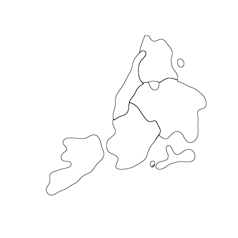

Homework 3 Write-Up - Team 6: Fantastic Fishes
========================================================
###Team Members' Names: 
###Sarah Normoyle, Gonzalo Bustos, Xin Xu, Arpita Mandan

The geocoding, recreating the NYC boroughs, and the visualization code in all contained in ```hw3.R```. The script produces 2 files, ```boroughs.json``` and ```vis_data.Rdata```. ```vis_data.Rdata``` is loaded into this file and used to produce the visualization plot. 

##Geocoding

To begin the geocoding process, the script reads the NYC 311 file and filters the important columns we will use later. It removes the unspecified boroughs and missing boroughs. To geocode, we only worked with the incident addresses. There is some information in other columns, but this column has the most information. Next, the names of boroughs were changed to short names for merging later. The pluto and nyc data was merged by left joining nyc addresses with pluto data by address and borough to get geocoding for the incident addresses for NYC. The data was merged by address and borough because some addresses may have the same name but be in different boroughs.

##Recreating NYC Boroughs

To recreate the NYC boroughs, we will be using a SVM model to predict the boroughs given the longitude and latitude. First, a raster of points in a square that encompasses NY was created. These points were put into a data frame. To make our model more accurate for predciting boroughs, a set of points was created that are not NY to train the model. Because our NYC data has longitudes and latitudes of points that are in NY, we can easily create a set of points that are not NY. This was done by rounding the points to the nearest hundredths digit and then removing the NY points from the set of the raster points. Thus, we are left with points that are found outside of NY. A 6th class was added to these set of points, which is known as "ZOther." The NY points with their boroughs along with the points of this "ZOther" class were used to train the SVM model. This model is then fed all the raster points and predicts the point to be in a borough or to be in the "ZOther" class.

Now we have a lot of points along with their borough class based on the prediciton of the model. Next we create polygons for the 6 different classes. Subsetting only the 5 borough classes, we then use these polygons to create a json file of the boundaries of the 5 boroughs.



##Visualization

For the visualization, we experimented with different ways to plot interesting ways of looking at the points. It was determined to look at aspects of the data, one needs to subset to look at specific elements of the data depending on what you want to look at. Figuring out what to subset and how to subset the messy data can take some time to figure out because there are so many points. For our visualization, we subsetted three different incidents types that occurred just on two days. This data was subsetted from the merged data from the earlier borough investigation. Because we subsetted from the merged data only, we acknowledge that we can only get the incidents that have addresses that occur in the pluto data. To subset the dates, the date column had to be cleaned and the ```lubridate``` package was used to extract the year, month, and day for each row. This data of the longitudes and are stored in ```vis_data.Rdata```.

The longitudes and latitudes for this subset of incidents are then plotted on top of the map for New York, which can be seen below.

```{r}
library(ggmap)
load("vis_data.Rdata")
# plot types and locations against new york map #
newyork_map = get_map(location = 'New York', zoom = 10)

ggmap(newyork_map) +
  geom_point(aes(x = vis_data$x, y = vis_data$y, colour = Type), 
    data = vis_data, alpha = .5, size = 2)
```

We can see from this small subset of points where these incident types seem to lie. It is noted that driveway incidents occur a lot in the middle and incidenst involving parking and streets occur more on the outside. 
